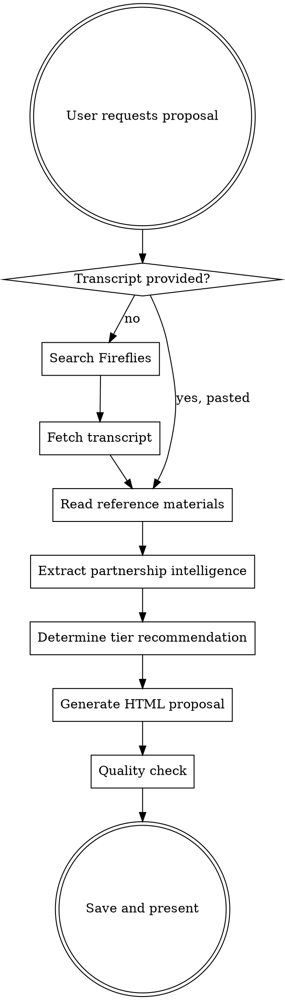

# NGM Commons Partnership Proposal Generator

Generate branded partnership proposals for prospective NGM Commons vendor partners by extracting intelligence from Fireflies meeting transcripts.

## When to Use

- After a sales call with a prospective Commons vendor partner
- User says "create a commons proposal," "vendor proposal," or "proposal from our call"
- User pastes or references a meeting transcript about a vendor partnership
- User asks to follow up on a vendor conversation with a proposal

## When NOT to Use

- Consulting proposals for clinicians (use `proposal-generator`)
- General outreach responses (use `outreach-responder`)
- Updating the partnership agreement template (edit `content/docs/ngm-commons-partnership-agreement.html` directly)

---

## Workflow



---

## Step 1: Obtain the Transcript

### Option A: Pull from Fireflies (preferred)

Search for the meeting using available context (company name, date, attendee):

```
fireflies_search: keyword:"[company name]" limit:5
```

Or list recent transcripts:

```
fireflies_get_transcripts: limit:10 mine:true
```

Then fetch the full transcript:

```
fireflies_fetch: id:"[transcript_id]"
```

Also fetch the summary for quick reference:

```
fireflies_get_summary: transcriptId:"[transcript_id]"
```

### Option B: User-provided transcript

If the user pastes a transcript or provides a file path, use that directly.

---

## Step 2: Read Reference Materials

Before generating, ALWAYS read these files:

1. **Voice & style:** `.claude/skills/document-studio/voice-and-style.md`
2. **NGM programs:** `.claude/skills/document-studio/ngm-programs.md`
3. **Design system:** `.claude/skills/document-studio/design-system.md`
4. **Existing proposals:** Glob `content/docs/proposal-*.html` and read 1-2 recent ones for tone calibration

Also read the partnership agreement for tier details:
- `content/docs/ngm-commons-partnership-agreement.html`

---

## Step 3: Extract Partnership Intelligence

From the transcript, extract and organize:

### Company Profile
- Company name, website, founding date
- Product/service category (diagnostics, supplements, software, devices, services)
- Stage (startup, growth, established)
- Funding status (for startup program eligibility: <2 years old OR <$5M raised)

### Partnership Signals
- What brought them to the conversation?
- Are they already marketing to clinicians? How?
- Do they understand the AI discoverability angle?
- Competitive pressure (are competitors already on Commons?)
- Budget signals or objections mentioned

### Product Fit for Commons
- Is their product relevant to longevity/functional/integrative clinicians?
- What category would their profile fall under?
- Do they have clinical evidence or research to feature?
- What differentiates them from competitors in their category?

### Relationship Context
- Warm intro or cold outreach?
- Existing relationship with Dr. Vinjamoori or NGM community?
- Level of engagement during the call (enthusiastic, cautious, skeptical)
- Specific questions they asked

---

## Step 4: Determine Tier Recommendation

| Signal | Recommended Tier |
|--------|-----------------|
| Early-stage, budget-conscious, testing the waters | **Partner** ($5,000/year) |
| Wants lead gen + profile + analytics | **Partner** ($5,000/year) |
| Wants category leadership, co-branded content | **Sponsor** ($12,500/year) |
| Wants executive access to Dr. Vinjamoori | **Sponsor** ($12,500/year) |
| Startup (<2 yrs or <$5M raised) | **Partner w/ Startup Program** ($2,500/year) |

Present the recommended tier prominently, with the alternative tier as an option. Always present both.

---

## Step 5: Generate HTML Proposal

### Output Location

`content/docs/proposal-commons-[company-slug]-[YYYY-MM-DD].html`

### Section Framework

#### 1. Header
- NGM Commons wordmark with "N" logo mark
- "Partnership Proposal" label
- Date and "Prepared for [Company Name]"

#### 2. Executive Summary (2-3 sentences)
- What Commons is
- Why this company is a fit
- The outcome of partnering

**Template:**
> NGM Commons is the vendor intelligence platform where longevity clinicians research solutions before they buy. Based on our conversation, [Company] is well-positioned to reach this audience through an independently researched, AI-optimized profile. This proposal outlines how a Commons partnership puts [Company] in front of clinicians at the moment they're making purchasing decisions.

#### 3. The Opportunity
Extract from transcript:
- The problem they're trying to solve (clinician discovery, lead gen, trust gap)
- Why traditional marketing isn't working for them
- The AI discoverability angle (clinicians asking ChatGPT/Perplexity, not Googling)

#### 4. What You Get (Profile Details)
Describe the six profile components:
1. **Quick Take** - Cited executive summary
2. **How It Works** - Mechanisms, workflows, architecture
3. **Evidence** - Research citations, validation data
4. **Practitioner Fit** - Which clinician types benefit
5. **Metadata** - AI-parseable tags for discoverability
6. **Citations** - Every claim backed by references

#### 5. Your Partnership Tier
Present recommended tier with full benefit breakdown. Include the alternative tier for comparison.

Use the tier table from the partnership agreement:

| Tier | Investment | Key Benefits |
|------|-----------|-------------|
| **Partner** | $5,000/year | Full profile, brand customization, lead capture, analytics, category roundups, quarterly strategy call |
| **Sponsor** | $12,500/year | Everything in Partner + category sponsorship, content co-creation, event partnership, executive access, priority support |

If startup-eligible, note: "Startup Program: 50% off first year."

#### 6. Why Clinicians Trust Commons
- Built by Dr. Vinjamoori (Harvard Med, CMO of Modern Age, advisor to $1B+ in longevity companies)
- Independent research methodology, not vendor-written content
- 200,000+ monthly LinkedIn impressions reaching longevity clinicians, plus an engaged private practitioner community that uses the platform
- AI-native structure ensures visibility in clinician AI queries

#### 7. Next Steps
Clear CTA:
- "Reply to this email to select your tier"
- "Schedule a follow-up call to discuss"
- Include email: anant@nextgenerationmedicine.co

---

## Step 6: Quality Checklist

Before saving, verify:

- [ ] Company name and date are correct throughout
- [ ] Executive summary references specific conversation points
- [ ] Tier recommendation matches signals from transcript
- [ ] Startup program mentioned if company qualifies
- [ ] Profile components accurately described
- [ ] Tone is confident and specific, not salesy
- [ ] No placeholder text remains
- [ ] HTML renders correctly with NGM design system styling
- [ ] Clear CTA with contact info
- [ ] Prints cleanly to PDF

---

## HTML Styling

Use the same design system as `content/docs/ngm-commons-partnership-agreement.html`:

- **Fonts:** Cormorant Garamond (headings), Source Serif 4 (body), DM Sans (labels/UI)
- **Colors:** `--paper: #FEFDFB`, `--ink-900: #302C27`, `--gold: #C49A6C`
- **Components:** Section numbers, highlight boxes with gold left-border, tier table, logo mark
- **Print-ready:** 8.5in page width with print media queries

Reference `design-system.md` for full CSS variables and component patterns.

---

## Anti-Patterns

| Don't | Do Instead |
|-------|-----------|
| Generic "we're the best platform" language | Specific: "200,000+ monthly LinkedIn impressions reaching longevity clinicians actively researching vendors in your category" |
| Dump all of Dr. V's credentials | Select 2-3 relevant to the vendor's space |
| Lead with pricing | Lead with the opportunity and profile value |
| Use "revolutionary" or "cutting-edge" | Use specific outcomes and metrics |
| Make it longer than 3 pages | Keep it tight: opportunity, solution, investment, next steps |
| Ignore what they said in the call | Reference specific things from the transcript |

---

## Example Invocations

**After a call (Fireflies):**
```
Create a Commons proposal for Vitract. We spoke yesterday about their diagnostics platform.
```

**With pasted transcript:**
```
Here's the transcript from my call with NutraLab. Generate a Commons partnership proposal.
[paste transcript]
```

**With specific tier:**
```
Create a Commons sponsor-tier proposal for BioAge Labs based on our Fireflies call from last week.
```

---

## Reference

For detailed program info, pricing, and positioning:
- `.claude/skills/document-studio/ngm-programs.md` (NGM Commons section)
- `.claude/skills/document-studio/voice-and-style.md` (tone guide)
- `content/docs/ngm-commons-partnership-agreement.html` (formal agreement terms)
